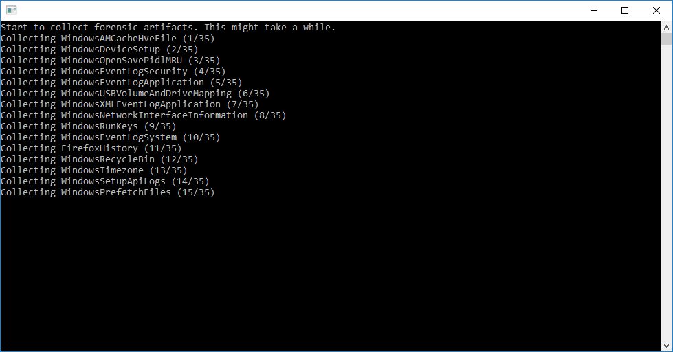

<h1 align="center">artifactcollector</h1>

<p  align="center">
 <a href="https://godocs.io/github.com/forensicanalysis/artifactcollector"></a>
</p>

The artifactcollector is a tool to collect forensic artifacts on a system. 
It can be used in forensic investigations to extract specific data instead of creating full disk images. 
The artifactextractor can collect low-level (like $MFT) 
and high-level file artifacts as well as registry keys (e.g. run keys) 
which can then be used in forensic investigations.


_Running the artifactextractor on Windows._

The artifactcollector is a single binary that can be transferred to computers 
which are part of a forensic investigation.

## Features

The artifactcollector offers the following features

- ️🖥️ Runs on **Windows**, **Linux** and **macOS**
  - 🏛️ Supports also old Windows versions like **Windows 2000** or **Windows XP**
- 🛍️ Can extract **files**, **directories**, **registry entries**, **command output**, and **WMI output**
- ⭐ Uses the configurable and extensible [**Forensics Artifacts**](https://github.com/forensicanalysis/artifacts)
- 🧩 Can run additional **embedded executables**
- 🕊️ **Open source**

## Download

All releases of the artifactcollector can be downloaded from [Releases](https://github.com/forensicanalysis/artifactcollector/releases). 
Prebuild artifactcollectors for Windows, Linux and macOS are available. 
Those artifactcollectors collect a predefined set of artifacts which are mostly taken from the Sans FOR500 training. 
Sans provides a comprehensive [poster](https://www.sans.org/security-resources/posters/windows-forensic-analysis/170/download)
explaining those artifacts.

## Usage

> [!WARNING]
> The artifactcollector behaves similar to malware as it collects critical system files
> and might be detected as a virus or malware.

On Windows the `artifactcollector.exe` can be executed by double-clicking it on the investigated machine. 
The user will be provided with a [UAC prompt](https://en.wikipedia.org/wiki/User_Account_Control) because the
artifactcollector required administrator rights to run. 
The collection takes some minutes, depending on processing power and contained artifacts.

On Linux and macOS the `artifactcollector` needs to be executed as root, e.g. `sudo artifactcollector`. 
macOS can still prevent the execution, in this case right-click the artifactcollector, 
select "Open", confirm "Open" and then try again with `sudo artifactcollector`.

## Output

The artifactcollecor will create a zip file and a log file. 
The log file serves two purposes: 
inform an investigator about errors during the collection but
also give the user a way to know what elements were extracted. 
The zip file contains the results of the extraction and needs to be transferred back to the investigator.

## Build your own artifactcollector

1. Clone the repository: `git clone https://github.com/forensicanalysis/artifactcollector`.
2. Add artifact definition yaml files as needed in `config/artifacts`. Do not edit the
   artifact definitions, as they will be overwritten.
3. Edit `config/ac.yaml` and add the artifacts you want to collect.
4. On windows, you can move the syso into the root folder (e.g. `cp resources\artifactcollector.syso .`)
   to enable the icon for the executable and the UAC popup.
5. Run `make build` to generate the artifactcollector binary.

## Embed binaries

Binaries can be added to `config/bin` and then included into the artifactcollector
in the `make build` step. Additionally, a corresponding COMMAND artifact like
the following is required.

```yaml
name: Autoruns
sources:
  - type: COMMAND
    attributes:
      cmd: autorunsc.exe
      args: [ "-x" ]
supported_os: [ Windows ]
```

The command output to stdout and stderr is saved, but generated
files are not collected.

## License

Most of the artifactcollector is licensed under the MIT License. See [MIT license](LICENSE) for the full license text.

The directories [store/aczip](store/aczip) and [build/go](build/go) contain code from the Go standard library
which is licensed under the [BSD-3-Clause license](LICENSE-BSD).